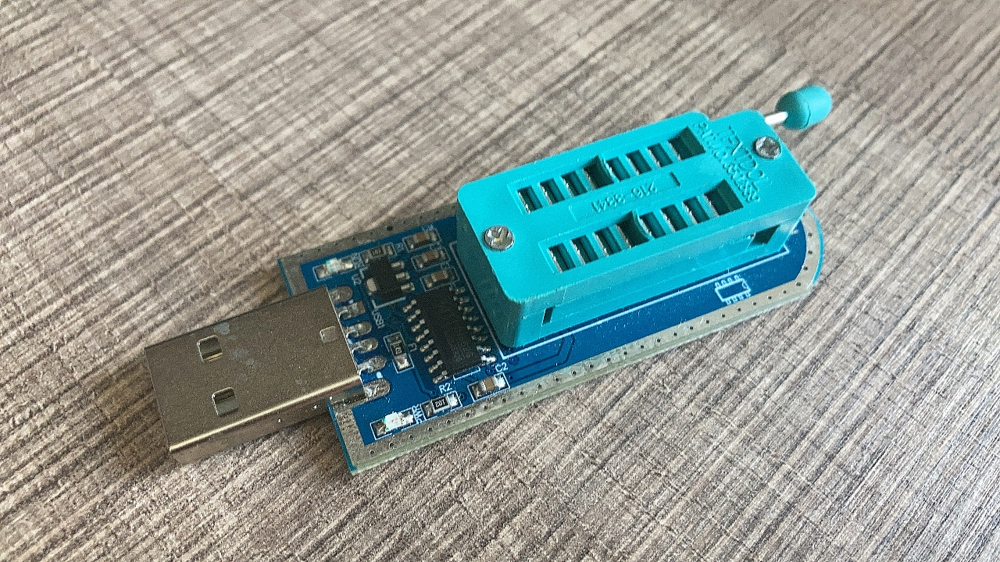

# YuzukiHCC
Yuzuki HDMI Capture Card

## About

Ultra low cast HDMI Capture Card based on MS2109

- Type C USB2.0 interface
- full height HDMI
- Compatible with DVI 1.0
- Supports HDCP 1.4 (no key provided in Firmware)
- Support YUV&JPEG output
- Compatible with UVC 1.0
- Support audio capture
- Support video capture
- Maximum video input 3840x2160@30
- The highest output resolution is 1920*1080@30

### Supported USB output resolution table

## Flash Firmware

Use an EEPROM flasher to flash the firmware before soldering.

## Links

OSHWHub OpenSource (Chinese): https://oshwhub.com/gloomyghost/yuzuki-hcc

